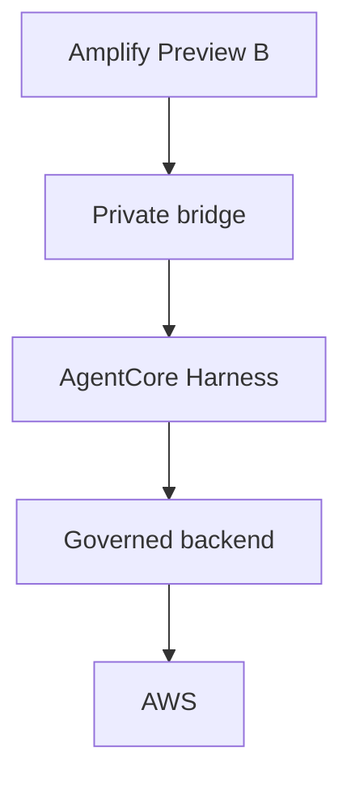

# Two separate surfaces

The Site runs in the browser: generated synthetic records, filter/selection,
deterministic context, frozen proposal, one consumed decision and simulated
evidence. It contains no AWS client, bridge, model or backend implementation.
`connect-src 'none'` denies application connection requests. Reset/reload
restores in-memory data; no browser storage or credentials are required.

The **separate engineering application** has this explanatory architecture:

The Harness investigates through registered tools. The governed backend owns
target checks, fixed capabilities and explicit single-use approval. Provider
readback and compliance evaluation are different observations. This Site only
explains that architecture; no arrow represents a connection from the Site.

## Simulated authority

Selection → compatible scope → immutable exact-target proposal → Approve Once
or Reject → evidence. Commands change filters/selection only. The assistant
cannot approve, expand a frozen target set or run arbitrary commands.

Rejection records zero writes for every target and skips readback/evaluation.
Approval changes only invented in-memory records. Optional blocked targets
fail before writing and remain NON_COMPLIANT. VERIFIED / PARTIAL / REJECTED
are mock outcomes, never evidence of an AWS write or Config convergence.
Evidence replay cannot execute. Switching filters/context invalidates pending
authority; existing run evidence remains explicitly scoped to its own targets.

The separate engineering demo is an ordinary explicit navigation link.
It may require private operator setup to use LIVE LAB. The Site never embeds,
prefetches or calls it. No bridge address, token or deployment identity is copied
into this portable package.
