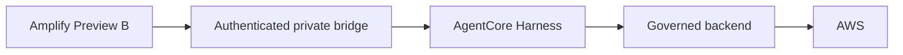

# Two separate surfaces

The Sites showcase runs entirely inside the browser: synthetic fixture → selected
finding → deterministic explanation/proposal → mock operator decision → mock
evidence. No request leaves the page for those interactions. A restrictive content
security policy also denies connection requests. No credentials or saved browser
state are needed. Reset/reload returns to the invented fixture.

The **separate engineering application** follows this path:

The Harness investigates with registered tools. The backend guards target scope,
registered capability and explicit one-time operator approval. It controls the
deterministic write. Provider policy readback and compliance evaluation are
separate results. The assistant cannot grant itself approval or widen scope.

The showcase illustrates these boundaries; it does not exercise them against a
provider. Its consumed mock proposal and five-step evidence timeline distinguish
Reject (zero writes, no new compliance result) from Approve Once (simulated write,
simulated readback, simulated compliance result). All models share this flow;
their selector only demonstrates the unchanged labels and input cost indices.

The linked engineering demo may need private operator setup to use LIVE LAB.
No bridge address, token or private deployment identity belongs in this package.
